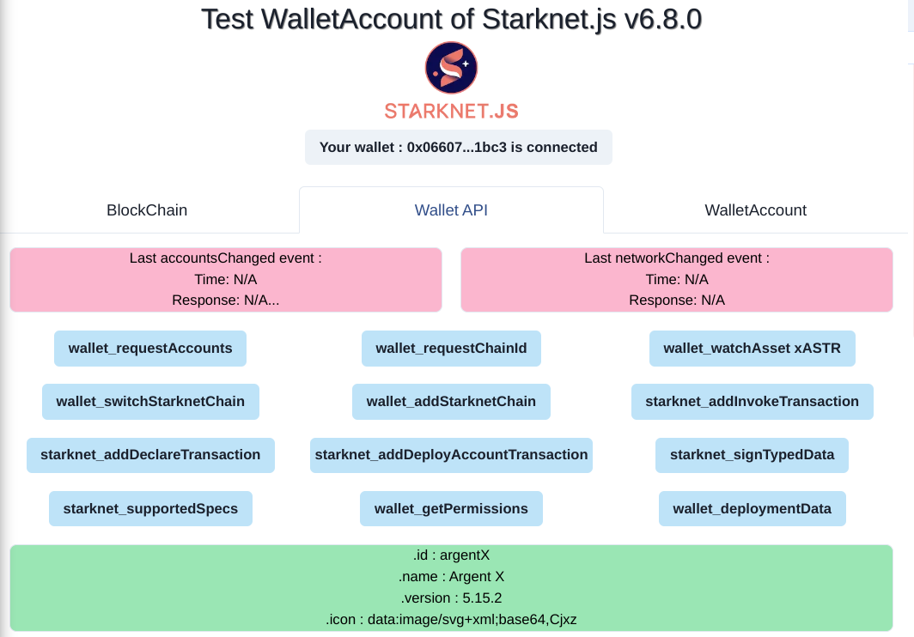
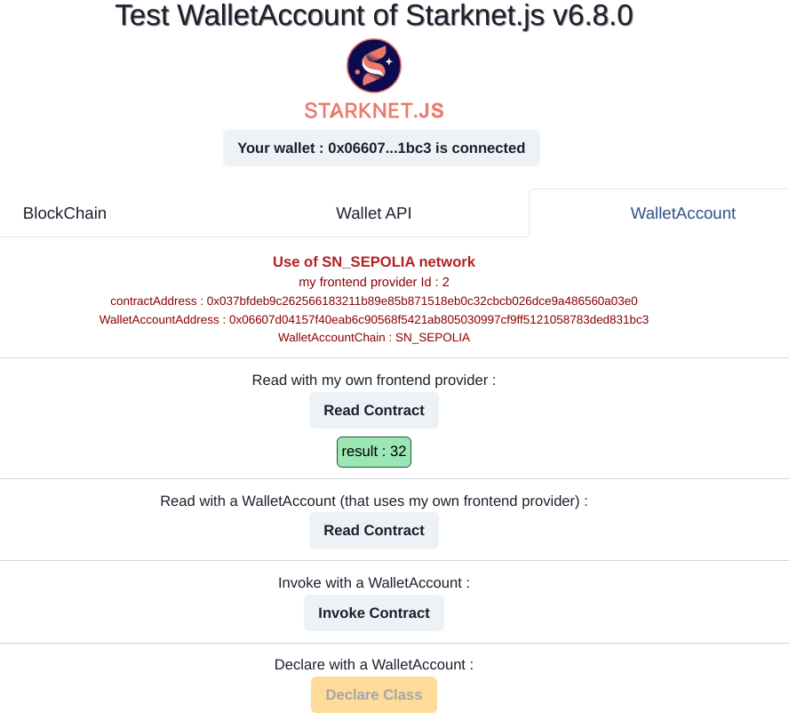
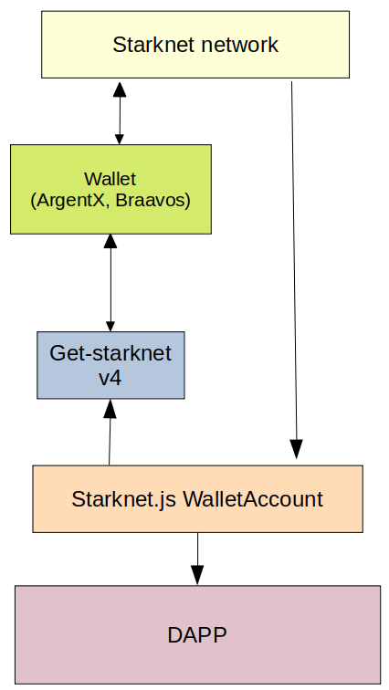

# Starknet-WalletAccount

## Presentation :

This repo contains a DAPP to interact with the Starknet blockchain, using the new wallet API.

**You can test this DAPP ; it's already deployed [here](https://starknet-wallet-account.vercel.app/)**.

> [!IMPORTANT]
> Stars are appreciated!
> 
## specification :

The official Starkware specification of the wallet API is here : https://github.com/starkware-libs/starknet-specs/blob/master/wallet-api/wallet_rpc.json

The corresponding TypeScript library is here : https://github.com/starknet-io/types-js

> [!IMPORTANT]
> - **An easier way to read the Wallet API: a documentation I created is [here](https://github.com/PhilippeR26/Starknet-WalletAccount/blob/api/doc/walletAPIspec.md).**  
> - A documentation for wallet teams is [here](https://github.com/PhilippeR26/Starknet-WalletAccount/blob/api/doc/migrateToGetStarknetV4.md).


### Wallet API entry points :
The `Wallet API` tab is exposing all the low level entry points of this API :


### WalletAccount usage :
The `WalletAccount` tab allows you to test some features of the Starknet.js `WalletAccountV6` class, and the `WalletAccountV6` tab its STRK20 privacy methods.

Let's see more in detail this WalletAccount.  
It's very similar to a Starknet.js `Account` class. There is anyway a huge difference : the private key is hold in a browser wallet (as Ready or Braavos), and any signature is managed by the wallet.  
The architecture is : 
<p align="center">
  
</p>  

If you want to read Starknet, the WalletAccount will read directly the blockchain. That's why at the initialization of a WalletAccount, you need to put in the parameters a Provider instance. It will be used for all reading activities.

If you want to write to Starknet, the WalletAccount will ask to the Wallet to sign and send the transaction.  
As several Wallets can be installed in your browser, the WalletAccount needs one of them. The get-starknet discovery store lists every wallet that announces itself through the wallet standard, and you pick one from that list.  
You then create your own UI to select the wallet. In this DAPP, I have created a custom UI [here](./src/app/components/client/WalletHandle/SelectWallet.tsx).  
So, you instantiate a new Wallet account with :
```typescript
import { createStore } from "@starknet-io/get-starknet-discovery"; // v6.0.6
import { constants, RpcProvider, WalletAccountV6 } from "starknet"; // v11.0.1

// Any RPC node ; a network name lets Starknet.js pick a default public one.
const myFrontendProvider = new RpcProvider({ nodeUrl: constants.NetworkName.SN_SEPOLIA });
// The wallets installed in the browser, to feed your selection UI :
const availableWallets = createStore().getWallets();
const selectedWallet = availableWallets[0];
const my_WAccount = await WalletAccountV6.connect(myFrontendProvider, selectedWallet);
```

Then you can use all the power of Starknet.js, exactly as a with a normal Account instance.  
And you have some extra functionalities :
- subscription to these events : account / network changes in the wallet.
- direct access to the wallet API entry points.


## Getting Started 🚀 :

For a local usage :  

First, create a `.env.local` file at the root of the project, containing your [Alchemy](https://www.alchemy.com/) API key :

```
NEXT_PUBLIC_PROVIDER_URL="<your-alchemy-api-key>"
```

This key is appended to the Alchemy RPC endpoints of Mainnet and Sepolia. Without it, neither network answers.

Then, run the development server:

```bash
npm i
npm run dev
```

Open [http://localhost:3000](http://localhost:3000) with your browser to see the result.  
<kbd>CTRL</kbd> + <kbd>SHIFT</kbd> + <kbd>I</kbd> to see debug information.

The DAPP is coded in Typescript, using Starknet.js v11.0.1, get-starknet v6, the Next.js 16 framework, Zustand context & Chakra-ui components.

## Deploy on Vercel 🎊 :

The easiest way to deploy your Next.js app is to use the [Vercel Platform](https://vercel.com/new?utm_medium=default-template&filter=next.js&utm_source=create-next-app&utm_campaign=create-next-app-readme) from the creators of Next.js.

Check out the [Next.js deployment documentation](https://nextjs.org/docs/deployment) for more details.


