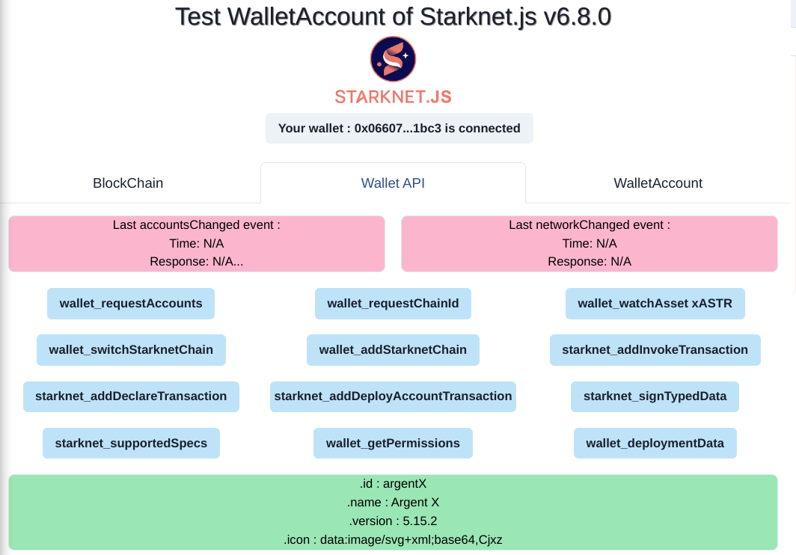
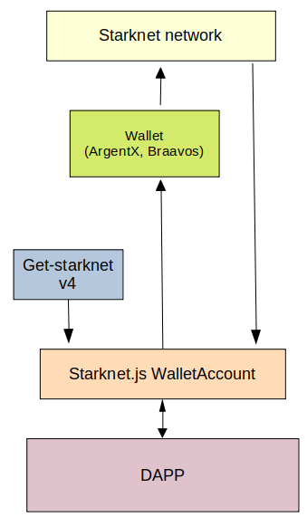

# Starknet-WalletAccount

## Presentation :

This repo contains a DAPP to interact with the Starknet blockchain, using the new wallet API.

**You can test this DAPP ; it's already deployed [here](https://starknet-wallet-account.vercel.app/)**.

> [!IMPORTANT]
> Stars are appreciated!

### Wallet API entry points :
The `Wallet API` tab is exposing all the low level entry points of this new API :


### WalletAccount usage :
The `WalletAccount` tab allows you to test some features of this new class of Starknet.js v6.8.

Let's see more in detail this WalletAccount.  
It's very similar to a Starknet.js `Account` class. There is anyway a huge difference : the private key is hold in a browser wallet (as ArgentX or Braavos), and any signature is managed by the wallet.  
The architecture is : 
<p align="center">
  
</p>  

If you want to read Starknet, the WalletAccount will read directly the blockchain. That's why at the initialization of a WalletAccount, you need to put in the parameters a Provider instance. It will be used for all reading activities.

If you want to write to Starknet, the WalletAccount will ask to the Wallet to sign and send the transaction.  
As several Wallets can be installed in your browser, the WalletAccount needs the ID of one of the available wallets. You can ask to get-starknet to display a list of available wallets and to provide as a response the ID of the selected wallet.  
You can also create your own UI to select the wallet. In this DAPP, I have created a custom UI [here](./src/app/components/client/WalletHandle/SelectWallet.tsx).  
So, you instantiate a new Wallet account with :
```typescript
import { connect } from "get-starknet"; // v4.0.0
import { WalletAccount } from "starknet"; // v6.8.0 min
const myFrontendProvider = "https://free-rpc.nethermind.io/sepolia-juno/v0_7";
// UI to select a wallet :
const selectedWallet = await connect({ modalMode: "alwaysAsk", modalTheme: "light" }); 
const my_WAccount = new WalletAccount(myFrontendProvider, selectedWallet);
```

Then you can use all the power of Starknet.js, exactly as a with a normal Account instance.  
And you have some extra functionalities :
- subscription to these events : account / network changes in the wallet.
- direct access to the wallet API entry points.


## specification :

The official Starkware specification of the wallet API is here : https://github.com/starkware-libs/starknet-specs/wallet-api/wallet_rpc.json

The corresponding TypeScript library is here : https://github.com/starknet-io/types-js

**An easier to read Wallet API documentation I created is [here](doc/walletAPIspec.md)**

## Getting Started 🚀 :

For a local usage :  

First, run the development server:

```bash
npm i
npm run dev
```

Open [http://localhost:3000](http://localhost:3000) with your browser to see the result.  
<kbd>CTRL</kbd> + <kbd>SHIFT</kbd> + <kbd>I</kbd> to see debug information.

The DAPP is made in the next.js framework. Coded in Typescript. Using Starknet.js v6.8.0, get-starknet v4, Next.js framework, Zustand context & Chaka-ui components.

## Deploy on Vercel 🎊 :

The easiest way to deploy your Next.js app is to use the [Vercel Platform](https://vercel.com/new?utm_medium=default-template&filter=next.js&utm_source=create-next-app&utm_campaign=create-next-app-readme) from the creators of Next.js.

Check out the [Next.js deployment documentation](https://nextjs.org/docs/deployment) for more details.


