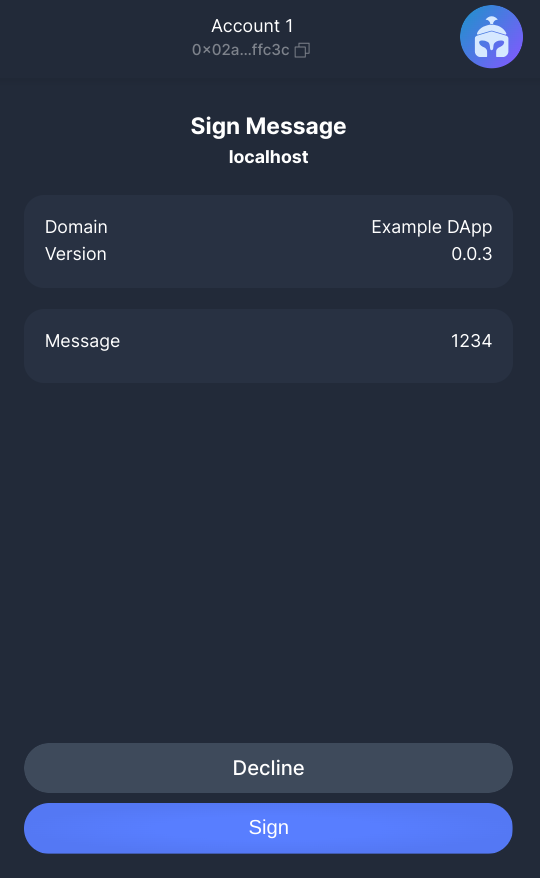

# Migrate Get-Starknet v3->v4 <!-- omit from toc -->
**Documentation for wallet teams**

> version : v1.1.1 29/aug/2024.  
> version : v1.1.0 19/aug/2024.  
> version : v1.0.0 29/jul/2024.  

This document is explaining how Starknet browser wallet teams have to modify their code to migrate from Get-Starknet v3 to v4. A chapter is also explaining basic concepts for teams onboarding directly in V4.  
- [From get-starknet v3 to v4 :](#from-get-starknet-v3-to-v4-)
- [Onboarding with get-starknet V4 :](#onboarding-with-get-starknet-v4-)
  - [Starknet :](#starknet-)
  - [Starknet.js :](#starknetjs-)
  - [RpcProvider :](#rpcprovider-)
  - [Account Contract :](#account-contract-)
- [SWO V4 (Starknet Window Object) :](#swo-v4-starknet-window-object-)
- [DAPP connection to the wallet :](#dapp-connection-to-the-wallet-)
- [Available commands :](#available-commands-)
  - [wallet\_getPermissions :](#wallet_getpermissions-)
  - [wallet\_requestAccounts :](#wallet_requestaccounts-)
  - [wallet\_watchAsset :](#wallet_watchasset-)
  - [wallet\_addStarknetChain :](#wallet_addstarknetchain-)
  - [wallet\_switchStarknetChain :](#wallet_switchstarknetchain-)
  - [wallet\_requestChainId :](#wallet_requestchainid-)
  - [wallet\_deploymentData :](#wallet_deploymentdata-)
  - [wallet\_addInvokeTransaction :](#wallet_addinvoketransaction-)
  - [wallet\_addDeclareTransaction :](#wallet_adddeclaretransaction-)
  - [wallet\_signTypedData :](#wallet_signtypeddata-)
  - [wallet\_supportedSpecs :](#wallet_supportedspecs-)
  - [wallet\_supportedWalletApi :](#wallet_supportedwalletapi-)
- [Wallet API version :](#wallet-api-version-)
- [Subscription to events :](#subscription-to-events-)

# From get-starknet v3 to v4 :
As you will discover hereunder, the Starknet Window Object (SWO) is still there, but it includes no more any Provider or Account. The already existing `.request()` method is still there, and nearly everything is now processed through it. The handling of events has not changed, and is still managed with the methods `.on()` & .`off()`.

# Onboarding with get-starknet V4 :
This documentation is mainly focused on migration from existing wallets using get-Starknet v3, but it can also be used by all new teams that wants to implement Starknet directly with get-Starknet v4.

Nevertheless, some preliminary concepts have to be assimilated :
## Starknet :
As Starknet network is not EVM compatible, some new concepts have to be understood prior of coding. Read the official Starknet documentation https://docs.starknet.io/, especially the Architecture chapter.

## Starknet.js :
The SDK to use to communicate with Starknet is the npm library `starknet`. Even if `ethers` library users will recognize many known concepts in Starknet.js, it's important to read the official documentation : https://www.starknetjs.com/, particularly the [guides](https://www.starknetjs.com/docs/next/guides/intro).

##  RpcProvider :
There are 2 Starknet networks :
- Starknet Mainnet (linked to L1 Ethereum Mainnet)
- Starknet Testnet (linked to L1 Sepolia Testnet)

All the interactions to perform with a Starknet network have to be processed through a RpcProvider.

Read this [guide](https://www.starknetjs.com/docs/next/guides/connect_network) to connect a RpcProvider. 

## Account Contract :
In Starknet, everything is a contract, including the accounts. Contracts are deployed as children of a class. So, you have to select an account class (or create your own class) for your wallet.  
Read this [guide](https://www.starknetjs.com/docs/next/guides/create_account) to create a Starknet account.

# SWO V4 (Starknet Window Object) :
The Wallet has still to create a new object called SWO (Starknet Window Object), and to implement it into the global `window` object (representing the browser's). The SWO name has still to start with `starknet` and should not use a name already implemented by the other wallets.   
Example of existing names : `starknet_bitkeep`, `starknet_okxwallet`, `starknet_braavos`, `starknet_argentx`.

The content of this SWO object is deeply modified ; it contains no more any Account or Provider objects ; most of the interactions are now handled by the `request` property. The SWO has to be conform to the `StarknetWindowObject` interface, defined in https://github.com/starknet-io/types-js/blob/main/src/wallet-api/StarknetWindowObject.ts

> [!NOTE]
> On Wallet side, the library get-starknet is not necessary ; only the SWO interface from the `types-js` library is needed.

The SWO still needs to provide some properties that are necessary to describe the wallet. They will be used in the DAPP in the window of wallet selection :  


These keys are :
- .id (ex: `argentx`)
- .name (ex: `Argent X`). Will be displayed by the DAPP.
- .version (ex: `3.4.5`). Can be used optionally by the DAPP.
- .icon (ex: `"data:image/svg+xml;base64,Cjxzdmcgd2lkdGg9..."`). A string defining the logo of the wallet. It will be used by the DAPP.

# DAPP connection to the wallet :
Using the get-starknet v4 library, the DAPP will search all the Starknet wallets implemented in the browser, and will ask to the user to select one of them.  
All readings of Starknet requested by the DAPP are now fully performed outside of the Wallet, but it's of course still involved in all write operations. This sharing is handled by the `WalletAccount` class, in the Starknet.js library (documentation [here](https://www.starknetjs.com/docs/next/guides/walletaccount/)).  
  

> [!TIP]
> The current stable version of Starknet.js is v6.11.0.

# Available commands : 
The `request` property of the SWO is now the main channel of communication. The WalletAccount class of Starknet.js will use this channel to work with the Wallet.  
Let's see all `request` entrypoints that a Wallet will have to process (listed in the official Wallet API spec available [here](https://github.com/starkware-libs/starknet-specs/blob/master/wallet-api/wallet_rpc.json)).  
All Types shown hereunder are available [here](https://github.com/starknet-io/types-js/blob/main/src/wallet-api/components.ts).  
You can test each entrypoint of your Wallet with this test DAPP : https://starknet-wallet-account.vercel.app/


For non silent commands : 
- If the Wallet is locked, the Wallet will first ask to unlock the UI.
- Then, if the DAPP is not connected, the Wallet will ask the authorization to connect the DAPP.
- Finally the command is processed.

## wallet_getPermissions :
### Usage :
Indicate if the active account of the Wallet is authorized to interact with the DAPP. 
### Input :
No parameters.
### Output :
```typescript
response : Permission[]

enum Permission {
  Accounts = "accounts",
}
```
### Behavior :
- If authorized, returns an array of strings. The first item content is the string `accounts` (equal to `Permission.Accounts` enum).
- If the DAPP is not authorized for the current Wallet account, the response is an empty array.
- If the Wallet is locked, the response is also an empty array.
- This command is silent on Wallet side. No display on UI.
### Example :
#### On DAPP side : 
```typescript
const resp = await myWalletAccount.getPermissions();
```
#### On Wallet side :
The wallet has to answer for example :
```
resp = ["accounts"]
```
### DAPP authorization :
First time the DAPP is performing a request to the current account of the Wallet (all requests, except `wallet_getPermission`), the UI is requesting a validation to connect the current Wallet account to this DAPP.  
  
Then the DAPP request is processed.

## wallet_requestAccounts :
### Usage :
Get the address of the active account of the Wallet. 
### Input :
```typescript
interface RequestAccountsParameters {
  silentMode?: boolean
}
```
### Output :
```typescript
response : string[]
```
### Behavior :
- Returns an array of hex strings ; just use the first element.
- Default optional silentMode : false -> if the Wallet is locked, or if the DAPP is not connected, the Wallet will ask to the user to unlock the Wallet or/and connect the DAPP to the current account. If the user rejects these requests, the answer is an empty array.
- Optional silentMode : if true, the wallet will not show the wallet-unlock UI in case of a locked wallet, nor the dApp-connect UI in case of a non-connected dApp. If the Wallet is unlocked and the DAPP connected, the response is the array of strings ; otherwise, the response is an empty array.
### Example :
#### On DAPP side : 
```typescript
const resp = await myWalletAccount.requestAccounts();
```
#### On Wallet side :
The wallet has to answer for example :
```
resp = ["0x067f5a62ec72010308cee6368a8488c8df74f1d375b989f96d48cde1c88c7929"]
```
  
## wallet_watchAsset :
### Usage :
Add a token in the list of assets displayed by the wallet. 
### Input :
```typescript
interface WatchAssetParameters {
  type: "ERC20" // The asset's interface, e.g. 'ERC20'
  options: {
    address: string // The hexadecimal Starknet address of the token contract
    symbol?: string // A ticker symbol or shorthand, up to 5 alphanumerical characters
    decimals?: number // The number of asset decimals
    image?: string // A string url of the token logo
    name?: string // The name of the token - not in spec
  }
}
```
### Output :
```typescript
response : boolean
```
### Behavior :
- The wallet opens a window to ask the user to  agree to add this token in the display list. If agreed, returns `true`. 


> [!CAUTION]
>  Take care of the optional parameters ; for obvious safety reason, it's preferable to have these parameters recovered by the Wallet, from the blockchain.
- If the address is not an ERC20, the method fails with this error : 
```typescript
interface NOT_ERC20 {
code: 111;
}
message: 'An error occurred (NOT_ERC20)';
```
- If the token is already displayed, no UI change, the result is `true`.
- If the user decline the proposal, the method fails with this error : 
```typescript
interface USER_REFUSED_OP {
  code: 113;
  message: 'An error occurred (USER_REFUSED_OP)';
}
``` 
- Other errors :
```typescript
interface INVALID_REQUEST_PAYLOAD {
  code: 114;
  message: 'An error occurred (INVALID_REQUEST_PAYLOAD)';
}
interface UNKNOWN_ERROR {
  code: 163;
  message: 'An error occurred (UNKNOWN_ERROR)';
}
```

### Example :
#### On DAPP side : 
```typescript
const addrxASTR = "0x005EF67D8c38B82ba699F206Bf0dB59f1828087A710Bad48Cc4d51A2B0dA4C29";
const myAsset: WatchAssetParameters = {
  type: "ERC20",
  options: {
      address: addrxASTR,
      decimals: 10,
      name: "xAstraly",
      symbol: "xASTR"
  }
}
const resp = await myWalletAccount.watchAsset(myAsset);
```
#### On Wallet side :
It's recommended to not rely the optional parameters and to recover them from the Starknet network :
```typescript
import { type Abi, Contract, RpcProvider } from "starknet";
const myProvider = new RpcProvider({nodeUrl: nodeUrlOfCurrentNetwork});
let isDeployed: boolean;
let abiERC20Contract: Abi; 
try {
    const contractSierra = await myProvider.getClassAt(asset.options.address);
    abiERC20Contract = contractSierra.abi;
    isDeployed = true;
    } catch { isDeployed = false }
if (!abiERC20Contract || !isDeployed) {
    throw new Error("Not Valid address");
}
const erc20Contract = new Contract(abiERC20Contract, asset.options.address, myProvider);
const decimals = await erc20Contract.call("decimals") as bigint;
const name = await erc20Contract.call("name") as string;
const symbol = await erc20Contract.call("symbol") as string;
```

The wallet has to answer for example :
```
resp = true
```
> [!NOTE]
> It's a good practice when the Wallet includes in its UI a way to manage and remove tokens of the display list.
  
## wallet_addStarknetChain :
### Usage :
Add a new network in the list of networks of the wallet. 
### Input :
```typescript
interface AddStarknetChainParameters {
  id: string
  chain_id: string // A 0x-prefixed hexadecimal string, of encoded name
  chain_name: string
  rpc_urls?: string[]
  block_explorer_urls?: string[]
  native_currency?: {
    type: 'ERC20'; // The asset's interface, e.g. 'ERC20'
    options: {
      address: string // The hexadecimal Starknet address of the token contract
      name?: string // The name of the token - not in spec
      symbol?: string // A ticker symbol or shorthand, up to 5 alphanumerical characters
      decimals?: number // The number of asset decimals
      image?: string // A string url of the token logo
    }
  } 
  icon_urls?: string[] // A string defining the logo of the wallet.
}
```
### Output :
```typescript
response : boolean
```
### Behavior :
- Starknet is implemented in 2 networks : Mainnet (SN_MAINNET) & Testnet (SN_SEPOLIA). Nevertheless, some Devnets, private networks or layer 3 networks, have to be accessed by the Wallet.
- The wallet opens a window to ask if the user agree to add this network in the wallet. If agreed, returns `true`. 


- If something is inconsistent in the input data, fails with error :
```typescript
interface INVALID_REQUEST_PAYLOAD {
  code: 114;
  message: 'An error occurred (INVALID_REQUEST_PAYLOAD)';
}
```
- If the network is already listed, no UI change, the result is `true`.
- If the user decline the proposal, the method fails with this error : 
```typescript
interface USER_REFUSED_OP {
  code: 113;
  message: 'An error occurred (USER_REFUSED_OP)';
}
``` 
- Other error :
```typescript
interface UNKNOWN_ERROR {
  code: 163;
  message: 'An error occurred (UNKNOWN_ERROR)';
}
```
### Example :
#### On DAPP side :
```typescript
const myChain: AddStarknetChainParameters = {
    id: "ZORG",
    chainId: shortString.encodeShortString("ZORG"),  
    chainName: "ZORG",
    rpcUrls: ["http://192.168.1.44:6060"],
    nativeCurrency: {
        type: "ERC20",
        options: {
            address: "0x049d36570d4e46f48e99674bd3fcc84644ddd6b96f7c741b1562b82f9e004dc7",
            name: "ETHER",
            symbol: "ETH",
            decimals: 18,
        }
    }
}
const resp = await myWalletAccount.addStarknetChain(myChain);
```
#### On Wallet side :
To verify that this request is describing an alive Starknet network :  
```typescript
const TIMEOUT = 4000;

function wait(delay: number) { // ms
    return new Promise((res) => {
        setTimeout(res, delay);
    });
}
async function testNode(url: string, idx: number): Promise<number | undefined> {
    const provider = new RpcProvider({ nodeUrl: url });
    try {
        const chainId = await provider.getChainId();
        if (chainId == newChain.chainId) {
            return idx
        }
        await wait(TIMEOUT);
        return undefined;
    } catch {
        await wait(TIMEOUT);
        return undefined;
    }
};
const urlNum: (number | undefined) = await Promise.any(newChain.rpcUrls.map((url: string, idx: number) => {
    return testNode(url, idx);
}));
if (urlNum === undefined) {
    console.log("Not connected.");
} else {
    console.log("Connected to url #", urlNum);
}
```

As for `wallet_watchAsset`, it's recommended to recover the fee token data directly from the network. See [here](#on-wallet-side--2).  
The wallet has to answer for example :
```
resp = true
```
> [!NOTE]
> It's a good practice when the Wallet includes in its UI a way to manage and remove networks of the list.
 
## wallet_switchStarknetChain :
### Usage :
Change the current network of the wallet. 
### Input :
```typescript
interface SwitchStarknetChainParameters {
  chainId: string // A 0x-prefixed hexadecimal string of an encoded text
}
```
### Output :
```typescript
response : boolean
```
### Behavior :
- The wallet opens a window to ask if you agree to change the current network in the wallet. If you agree, returns `true`. 


- If the network is already the current one, no UI change, the result is `true`.
- If the network is not listed by the Wallet, the method fails with this error :
```typescript
interface UNLISTED_NETWORK {
  code: 112;
  message: 'An error occurred (UNLISTED_NETWORK)';
}
```
- If the user decline the proposal, the method fails with this error : 
```typescript
interface USER_REFUSED_OP {
  code: 113;
  message: 'An error occurred (USER_REFUSED_OP)';
}
```
- Other error :
```typescript
interface UNKNOWN_ERROR {
  code: 163;
  message: 'An error occurred (UNKNOWN_ERROR)';
}
```
### Example :
#### On DAPP side : 
```typescript
const myChainId: SwitchStarknetChainParameters = {
    chainId: "0x534e5f5345504f4c4941" // SN_SEPOLIA
}
const resp = await myWalletAccount.switchStarknetChain(myChainId);
```
#### On Wallet side :

The wallet has to answer for example :
```
resp = true
```
## wallet_requestChainId :
### Usage :
Returns the chainId of the current network of the wallet. 
### Input :
No parameters.
### Output :
```typescript
response : string
```
main chainIds :
  SN_MAIN = "0x534e5f4d41494e",
  SN_SEPOLIA = "0x534e5f5345504f4c4941",
### Behavior :
- No impact on UI.
- No errors for this method.
### Example :
#### On DAPP side : 
```typescript
const resp = await myWalletAccount.getChainId();
```
#### On Wallet side :
A chainId can be calculated with 
```typescript
const chainId = shortString.encodeShortString("NEW_CHAIN")
```

The wallet has to answer for example :
```
resp = "0x534e5f5345504f4c4941"
```

## wallet_deploymentData :
### Usage :
Request the deployment data of an account created in the Wallet, but not yet deployed in Starknet. 
### Input :
No parameters.
### Output :
```typescript
response : interface AccountDeploymentData {
  address: string // the expected address, used to double-check the returned data
  class_hash: string // The class hash of the contract to deploy
  salt: string // The salt used for the computation of the account address
  calldata: string[] // An array of felts
  sigdata?: string[] // An optional array of felts to be added in the signature
  version: 0 | 1 // Cairo version of the contract of the account (an integer)
}
```
### Behavior :
Provides the data that will be used by the wallet to deploy an existing account (existing in the wallet, but not yet in the network).  
- If the current account is already deployed, the method fails with this error : 
```typescript
interface ACCOUNT_ALREADY_DEPLOYED {
  code: 115;
  message: 'An error occurred (ACCOUNT_ALREADY_DEPLOYED)';
}
``` 
### Example :
#### On DAPP side : 
```typescript
const resp = await mySWO.request(type: "wallet_deploymentData");
```
#### On Wallet side :
- The salt is most of the time the Public Key of the account.
- The address can be calculated this way (if you deploy the account using the Universal Deployer Contract) :  
```typescript
const salt = ec.starkCurve.getStarkKey(privateKeyC20);
const addressDepl = hash.calculateContractAddressFromHash(ec.starkCurve.pedersen(deployerAccount.address, salt), classHash, constructor, constants.UDC.ADDRESS);
```
> [!IMPORTANT]
> Several ways to deploy an account are existing. The way you calculate the address has to be in accordance with the way you will deploy it in Starknet.

The wallet has to answer for example :
```
resp = {
   address: "0x0111fb83be44a70468d51cfcf8bccd4190cf119e4b2f83530ea13b5d35b9849d",
   class_hash: "0x03a5029a79d1849f58229e22f7f2b96bdd1dc8680e6cd5530a3122839f2ab878",
   salt: ""0xd3d12fb38fcc210966bcecd2ed83ba44b67e794209b994d1bac08f37f78e8e",
   calldata: [ "0xd3d12fb38fcc210966bcecd2ed83ba44b67e794209b994d1bac08f37f78e8e", "0x0" ],
   version:  1,
}
```

## wallet_addInvokeTransaction :
### Usage :
The user want to send one or several transaction(s) to the network. 
### Input :
```typescript
interface AddInvokeTransactionParameters {
  calls: Call[]
}
type Call = {
  contract_address: string
  entry_point: string
  calldata?: string[]
}
```
### Output :
```typescript
response : interface AddInvokeTransactionResult {
  transaction_hash: string
}
```
### Behavior :
- Using its UI, the wallet ask to the user to validate or reject the transaction(s).  
- It's the responsibility of the wallet to ask to the user which token he wants to use to pay the fees (it can't be handled on the user DAPP side, as there isn't any such parameter in `wallet_addInvokeTransaction` entrypoint).  
- The wallet should also display the estimated fees of the transaction(s).
 
Example of UI:  


- If the user approved the transaction in the wallet, the response is the transaction hash.
- If an error occurred with these parameters, fails with Error :
```typescript
interface INVALID_REQUEST_PAYLOAD {
  code: 114;
  message: 'An error occurred (INVALID_REQUEST_PAYLOAD)';
}
```
- If the user decline the proposal, the method fails with this error : 
```typescript
interface USER_REFUSED_OP {
  code: 113;
  message: 'An error occurred (USER_REFUSED_OP)';
}
```
- Other error :
```typescript
interface UNKNOWN_ERROR {
  code: 163;
  message: 'An error occurred (UNKNOWN_ERROR)';
}
```
### Example :
#### On DAPP side : 
```typescript
const funcName = "increase_balance";
const myCall = myErc20Contract.populate(funcName, {amount: 200});
const resp = await myWalletAccount.execute(myCall);
// resp = {transaction_hash: "0x067f5a62ec72010308cee6368a8488c8df74f1d375b989f96d48cde1c88c7929"}
```
> [!WARNING]
> The Calldata requested by this API is different from the one provided by Starknet.js.  
> So a conversion is needed when using this endpoint.

#### On Wallet side :
```typescript
import { Account, RpcProvider } from "starknet";
// provider initialization
const myProvider = new RpcProvider({ nodeUrl: "https://free-rpc.nethermind.io/sepolia-juno/v0_7" }); // example with a Starknet Testnet public node
// account initialization
const account0 = new Account(myProvider, accountAddress0, privateKey0);
```
With current Starknet v0.13.2, you can use ETH or STRK tokens to pay the fees. ETH fees are handled by a "legacy V2" transaction ; STRK fees are handled by a "V3" transaction.  
Currently there is no fee market. So if enough fees are proposed, the transaction is entering in a queue, and will be processed First In, First Out. The amount of fees depends of the complexity of the Cairo code to process in Starknet.
To estimate the fees of a "legacy V2" transaction :
```typescript
const { suggestedMaxFee: estimatedFee1 } = await account0.estimateInvokeFee(calls, {version: 2});
```

To estimate the fees of a V3 transaction :
```typescript
const fee = await account0.estimateInvokeFee(calls, {version: 3});
```

The complete answer for a V3 estimation :
```typescript
{
  overall_fee: 46098414083169n,
  gas_consumed: 2499n,
  gas_price: 18446744331n,
  unit: 'FRI',
  suggestedMaxFee: 69147621124753n,
  resourceBounds: {
    l2_gas: { max_amount: '0x0', max_price_per_unit: '0x0' },
    l1_gas: { max_amount: '0xabc', max_price_per_unit: '0x671447890' }
  }
}
```

The estimation of the fees isn't ultra accurate, and an extra fee of 50% is automatically added by `estimateInvokeFee()`.  
In some cases, it's not enough. Depending of the wallet strategy, the transactions can be proposed with low extra fees but there is a risk to have some transactions reverted, or the probability of success is very high but the extra fees have to be increased with :
- "legacy V2" :
```typescript
import { stark } from "starknet";
// to add 10% of fees
const increasedFees = stark.estimatedFeeToMaxFee(estimatedFee1, 0.1);
```
- V3 : 
```typescript
import { stark } from "starknet";
// to add 10% to amount and 20% to price
const fee2: FeeEstimate = {
        overall_fee: num.toHex(fee.overall_fee),
        gas_consumed: num.toHex(fee.gas_consumed),
        gas_price: num.toHex(fee.gas_price),
        unit: fee.unit,
        data_gas_consumed: num.toHex(fee.data_gas_consumed),
        data_gas_price: num.toHex(fee.data_gas_price)
    }
const increasedFeesV3: ResourceBounds = stark.estimateFeeToBounds(fee2, 10, 20);
```

If the user approve the transaction, it can be processed with :
- "legacy V2" :
```typescript
const resp = await account0.execute(calls,{
    version: 2,
    maxFee: increasedFees
});
const txReceipt = await myProvider.waitForTransaction(resp.transaction_hash);
```
- V3 :
```typescript
const resp = await account0.execute(calls,{
    version: 3,
    resourceBounds: increasedFeesV3
});
const txReceipt = await myProvider.waitForTransaction(resp.transaction_hash);
```
> [!TIP]
> To obtain the transaction receipt, you have to wait about 12 seconds. At the price of extra requests to the node, you can reduce this delay to improve the user experience, using this option :
>  ```typescript
>  const txReceipt = await myProvider.waitForTransaction(resp.transaction_hash, {retryInterval: 2000});
>  // The node is queried each 2 seconds
>  ```

The transaction receipt will provide results of the processing of the transaction(s), in particular if it succeed :
```typescript
txReceipt.match({
  success: (txR: SuccessfulTransactionReceiptResponse) => {
    console.log('Success =', txR);
  },
  rejected: (txR: RejectedTransactionReceiptResponse) => {
    console.log('Rejected =', txR);
  },
  reverted: (txR: RevertedTransactionReceiptResponse) => {
    console.log('Reverted =', txR);
  },
  error: (err: Error) => {
    console.log('An error occurred =', err);
  },
});
```

## wallet_addDeclareTransaction :
### Usage :
Declare a new class in the current network. 
### Input :
```typescript
interface AddDeclareTransactionParameters {
  compiled_class_hash: string // The hash of the Cairo assembly resulting from the Sierra compilation
  contract_class: {
    sierra_program: string[] // The list of Sierra instructions of which the program consists
    contract_class_version: string // The version of the contract class object. Currently, the Starknet OS supports version "0.1.0"
    entry_points_by_type: { // Entry points by type
      CONSTRUCTOR: SIERRA_ENTRY_POINT[]
      EXTERNAL: SIERRA_ENTRY_POINT[]
      L1_HANDLER: SIERRA_ENTRY_POINT[]
    },
    abi: string // The stringified class ABI, as supplied by the user declaring the class
    }
  class_hash?: string;
};
type SIERRA_ENTRY_POINT = {
  selector: string; // selector of the function name = selector.getSelectorFromName(funcName: string);
  function_idx: number;
};
```
### Output :
```typescript
response : interface AddDeclareTransactionResult {
  transaction_hash: string // The hash of the declare transaction
  class_hash: string // The hash of the declared class
}
```
### Behavior :
-The wallet opens a window to ask if you agree to declare a new class.

- If the user approved the declaration in the wallet, the response type is `AddDeclareTransactionResult`.
- If the user approved the declaration in the wallet, and if the class is already declared, the function throw an error :
```typescript
interface INVALID_REQUEST_PAYLOAD {
  code: 114;
  message: 'An error occurred (INVALID_REQUEST_PAYLOAD)';
}
```
Same error if an error occurred in the network.
- If the user decline the proposal, the method fails with this error : 
```typescript
interface USER_REFUSED_OP {
  code: 113;
  message: 'An error occurred (USER_REFUSED_OP)';
}
```
- Other error :
```typescript
interface UNKNOWN_ERROR {
  code: 163;
  message: 'An error occurred (UNKNOWN_ERROR)';
}
```
### Example :
#### On DAPP side : 
```typescript
const resp = await myWalletAccount.declare({
  contract: sierraContract, 
  casm: casmContract
});
```
#### On Wallet side :
- If you want to check if a class is already declared :
```typescript
const compiledContract: CompiledContract = {
    sierra_program: myParams.contract_class.sierra_program,
    entry_points_by_type: myParams.contract_class.entry_points_by_type,
    contract_class_version: myParams.contract_class.contract_class_version,
    abi: json.parse(myParams.contract_class.abi)
}
let isDeclared: boolean;
try {
    const classHash = myParams.class_hash
        ?
        myParams.class_hash
        : 
        hash.computeContractClassHash(compiledContract);
    await myProvider.getClassByHash(classHash);
    isDeclared = true;
} catch { isDeclared = false }
```
- To declare the contract class with the incoming parameters :
  To increase the estimated fees is similar to `wallet_addInvokeTransaction` ; see [here](#on-wallet-side--7)
```typescript
import { json } from "starknet";
if (myParams.contract_class.contract_class_version != "0.1.0") {
        throw new Error("Invalid contract version");
    }
    const payload: DeclareContractPayload = {
        contract: compiledContract,
        compiledClassHash: myParams.compiled_class_hash
    }
    const fees = await account0.estimateDeclareFee(payload, {version: 2}); 
    // or
    const fees = await account0.estimateDeclareFee(payload, {version: 3}); 
    // increase fees here if necessary
    const res = await account0.declare(payload, {version: 2, maxFee: increasedFees});
    //or 
    const res = await account0.declare(payload, {version: 3, resourceBounds: increasedFeesV3});
```
> [!NOTE]
> If the class is already declared, `account.declare()` will fail.

The wallet has to answer for example :
```
 resp = {
  transaction_hash: "0x067f5a62ec72010308cee6368a8488c8df74f1d375b989f96d48cde1c88c7929",
  class_hash: "0x2bfd9564754d9b4a326da62b2f22b8fea7bbeffd62da4fcaea986c323b7aeb"}
```

## wallet_signTypedData : 
### Usage :
Display and returns the signature of an EIP712 "like" message. 
### Input :
```typescript
interface TypedData {
  types: Record<string, StarknetType[]>
  primaryType: string
  domain: StarknetDomain
  message: Record<string, unknown>
}
type StarknetType =
    | {
  name: string
  type: string
}
    | StarknetEnumType
    | StarknetMerkleType;
type StarknetMerkleType = {
  name: string
  type: "merkletree"
  contains: string
};
export type StarknetEnumType = {
  name: string;
  type: 'enum';
  contains: string;
};
interface StarknetDomain extends Record<string, unknown> {
  name?: string
  version?: string
  chainId?: string | number
  revision?: string;
}
```
### Output :
```typescript
response : string[] // Signature. Standard signature is 2 felts, but depending of the wallet, response length can be different.
```
### Behavior :
See [SNIP-12](https://github.com/starknet-io/SNIPs/blob/main/SNIPS/snip-12.md) if you want to see the detailed specification.  
> [!NOTE]
> There are 2 formats of message to handle :
> - TypedDataRevision.LEGACY (with `StarkNetDomain` and Pedersen hash)
> - TypedDataRevision.ACTIVE (with `StarknetDomain` and Poseidon hash)
- The UI is showing the message in a manner the user can easily understand it, with a complete understanding of what he has to accept. If he accept to sign it, the response is a signature.  
  
- If an error is identified in the message format, the method fails with this error :
```typescript
interface INVALID_REQUEST_PAYLOAD {
  code: 114;
  message: 'An error occurred (INVALID_REQUEST_PAYLOAD)';
}
```
- If the user decline the proposal, the method fails with this error : 
```typescript
interface USER_REFUSED_OP {
  code: 113;
  message: 'An error occurred (USER_REFUSED_OP)';
}
```
- Other error :
```typescript
interface UNKNOWN_ERROR {
  code: 163;
  message: 'An error occurred (UNKNOWN_ERROR)';
}
```
### Example :
#### On DAPP side : 
```typescript
const myTypedData: TypedData = {
          domain: {
            name: "Example DApp", 
            chainId: SNconstants.StarknetChainId.SN_SEPOLIA,
            // chainId: '0x534e5f5345504f4c4941',
            version: "0.0.3",
            revision: TypedDataRevision.ACTIVE
          },
          types: {
            StarknetDomain: [
              { name: "name", type: "string" },
              { name: "chainId", type: "felt" },
              { name: "version", type: "string" },
              { name: "revision", type: "string" },
            ],
            Message: [{ name: "message", type: "felt" }],
          },
          primaryType: "Message",
          message: {
            message: "1234",
          },
        };
const resp = await myWalletAccount.signMessage(myTypedData);
```
#### On Wallet side :
- To hash a SNIP-12 message :
```typescript
const msgHash = typedData.getMessageHash(myTypedData, account0.address);
// or
const msgHash=await account0.hashMessage(myTypedData);
```
- To hash & sign a SNIP-12 message :
```typescript
const resultSignature: Signature = await account.signMessage(typedDataValidate) as WeierstrassSignatureType;
```
The wallet has to answer for example :
```
resp = ["0x490864293786342333657489548354947743460397232672997805795441858116745355019", "0x2855273948349341532300559537680769749551471477465497884530979636925080056604"]
```
> [!NOTE]
> The message can be more complex than the above basic example, with nested objects. An example of complex message is available [here](https://github.com/PhilippeR26/starknet.js-workshop-typescript/blob/72c3452716faabfefd2afe3d42b929985a6365e4/src/scripts/signature/4c.signSnip12vActive.ts#L20-L151). How this message should be displayed :  
> 

## wallet_supportedSpecs :
### Usage :
Returns a list of Starknet rpc spec versions compatible with the wallet. 
### Input :
No parameters.
### Output :
```typescript
response : string[]
```
### Behavior :
- The response is an array of strings. Each string is the version of a supported starknet API version. Includes only the 2 main digits, with the`.` as separator ; example : `0.7`.
- The current Starknet API is v0.7.2, and its official repo is [here](https://github.com/starkware-libs/starknet-specs/tree/master/api).
### Example :
#### On DAPP side :
```typescript
const resp = await myWallet.request(type: "wallet_supportedSpecs");
```
#### On Wallet side :
The provider can be queried to have its rpc spec version :
```typescript
const version = await myProvider.getSpecVersion();
```
The wallet has to answer for example :
```
resp = ["0.6","0.7"]
```

## wallet_supportedWalletApi :
### Usage :
Returns a list of Wallet API versions compatible with the wallet. 
### Input :
No parameters.
### Output :
```typescript
response : string[]
```
### Behavior :
- The response has to be an array of strings. Each string is the version of a supported Wallet API version. Includes only the 2 main digits, with the `.` as separator ; example : `0.7`.
- The current Wallet API version is v0.7.2. The repo of the official Wallet API is [here](https://github.com/starkware-libs/starknet-specs/blob/master/wallet-api/wallet_rpc.json).
### Example :
#### On DAPP side :
```typescript
const resp = await myWallet.request(type: "wallet_supportedWalletApi");
```
#### On Wallet side :
The wallet has to answer for example :
```
resp = ["0.7","0.8"]
```

# Wallet API version :
All entries of this Wallet API have an optional parameter to define the version of API used to create the request. 
Today, only v0.7 is supported.

## Example :<!-- omit from toc -->
```typescript
const myParams = {
  api_version: "0.7"
}
const resp = await myWallet.request(type: "wallet_requestChainId", params: myParams);
// resp = "0x534e5f5345504f4c4941"
```
## Error :<!-- omit from toc -->
In case of version not supported by the Wallet, the Wallet has to return an Error : 
```typescript
interface API_VERSION_NOT_SUPPORTED {
  code: 162;
  message: 'An error occurred (API_VERSION_NOT_SUPPORTED)';
}
```

# Subscription to events :
Users can subscribe to 2 events : 
- `accountsChanged` : Triggered by the wallet each time the current account in the wallet is changed.
- `networkChanged` : Triggered by the wallet each time the current network in the wallet is changed.

At each change of network, both account and network events are triggered by the wallet.  
At each change of account, only the account event is triggered by the wallet.  
All Types about events are [here](https://github.com/starknet-io/types-js/blob/main/src/wallet-api/events.ts).  
The wallet has to create a code that allow the user to perform such things : 

### Subscription :  
#### accountsChanged :
```typescript
const handleAccount: AccountChangeEventHandler = (accounts: string[] | undefined) => {
    if (accounts?.length) {
        const textAddr = accounts[0] // hex string
        setChangedAccount(textAddr); // from a useState
    };
};
myWallet?.on("accountsChanged", handleAccount);
```

#### networkChanged :
```typescript
const handleNetwork: NetworkChangeEventHandler = (chainId?: string, accounts?: string[]) => {
    if (!!chainId) { setRespChangedNetwork(chainId) }; // from a useState
}
myWallet?.on("networkChanged", handleNetwork);
```

### Un-subscription :
Similar to subscription, using `.off` method.
```typescript
wallet.off("accountsChanged", handleAccount);
wallet.off('networkChanged', handleNetwork);
```

