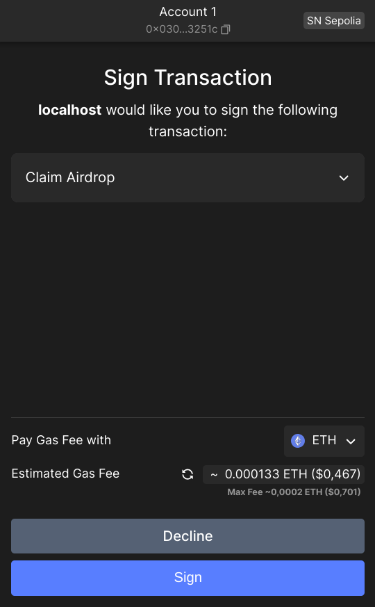

# Starknet Wallet API <!-- omit from toc -->
**Documentation for wallet teams**

> version : v1.0.0 28/jul/2024. 

This document is explaining how Starknet browser wallets can use the new interface with Starknet DAPPs.
- [Implementation in window object :](#implementation-in-window-object-)
- [DAPP connection to the wallet :](#dapp-connection-to-the-wallet-)
- [Subscription to events :](#subscription-to-events-)
- [Available commands :](#available-commands-)
  - [wallet\_getPermissions :](#wallet_getpermissions-)
  - [wallet\_requestAccounts :](#wallet_requestaccounts-)
  - [wallet\_watchAsset :](#wallet_watchasset-)
  - [wallet\_addStarknetChain :](#wallet_addstarknetchain-)
  - [wallet\_switchStarknetChain :](#wallet_switchstarknetchain-)
  - [wallet\_requestChainId :](#wallet_requestchainid-)
  - [wallet\_deploymentData :](#wallet_deploymentdata-)
  - [wallet\_addInvokeTransaction :](#wallet_addinvoketransaction-)
  - [wallet\_addDeclareTransaction :](#wallet_adddeclaretransaction-)
  - [wallet\_signTypedData :](#wallet_signtypeddata-)
  - [wallet\_supportedSpecs :](#wallet_supportedspecs-)
  - [wallet\_supportedWalletApi :](#wallet_supportedwalletapi-)
- [Wallet API version :](#wallet-api-version-)
  - [Example :](#example--12)
  - [Error :](#error-)

# Implementation in window object :
The Wallet has to add a new object in the global `window` object (representing the browser's window). Its name has to start with `starknet` and should not use a name already implemented by the others wallet.   
Example of existing names : `starknet_bitkeep`, `starknet_okxwallet`, `starknet_braavos`, `starknet_argentx`.

This object has to be conform to the `StarknetWindowObject` interface,  defined in https://github.com/starknet-io/types-js/blob/main/src/wallet-api/StarknetWindowObject.ts

In particular, some keys are necessary to describe the wallet. They will be used by the DAPP for the UI of wallet selection :


These keys are :
- .id (ex: `argentx`)
- .name (ex: `Argent X`). Will be displayed by the DAPP.
- .version (ex: `3.4.5`). Can be used optionally by the DAPP.
- .icon (ex: `"data:image/svg+xml;base64,Cjxzdmcgd2lkdGg9..."`). A string defining the logo of the wallet. It will be used by the DAPP.


https://github.com/starknet-io/get-starknet/blob/%40starknet-io/get-starknet%404.0.0/packages/core/src/main.ts

# DAPP connection to the wallet :
Using the get-starknet v4 library (or its own code), the DAPP will search all the Starknet wallets implemented in the browser, and will ask to the user to select one of them.  
All readings in Starknet will be performed without using the Wallet, but it will be involved in all write operations. This sharing is handled by the Starknet.js library.  
  
Starknet.js is a complete SDK for Starknet. You can install it with `npm install starknet@6.11.0`.

Some additional management methods have to be provided by the wallet ; they will also be described hereunder. 

# Subscription to events :
You can subscribe to 2 events : 
- `accountsChanged` : Triggered each time you change the current account in the wallet.
- `networkChanged` : Triggered each time you change the current network in the wallet.

At each change of network, both account and network events are occurring.  
At each change of account, only the account event is occurring.  

### Subscription :  
#### accountsChanged :
```typescript
const handleAccount: AccountChangeEventHandler = (accounts: string[] | undefined) => {
    if (accounts?.length) {
        const textAddr = accounts[0] // hex string
        setChangedAccount(textAddr); // from a useState
    };
};
myWallet?.on("accountsChanged", handleAccount);
```

#### networkChanged :
```typescript
const handleNetwork: NetworkChangeEventHandler = (chainId?: string, accounts?: string[]) => {
    if (!!chainId) { setRespChangedNetwork(chainId) }; // from a useState
}
myWallet?.on("networkChanged", handleNetwork);
```

### Un-subscription :
Similar to subscription, using `.off` method.
```typescript
wallet.off("accountsChanged", handleAccount);
wallet.off('networkChanged', handleNetwork);
```

# Available commands : 
All these commands can be used with `myWallet.request()` :

## wallet_getPermissions :
### Usage :
Indicate if the active account is authorized by the wallet to interact with the DAPP. 
### Input :
No parameters.
### Output :
```typescript
response : Permission[]

enum Permission {
  Accounts = "accounts",
}

```
### Behavior :
- If authorized, returns an array of strings. The first item content is  `accounts` (equal to `Permission.Accounts` enum).
- If not authorized, the response is an empty array.
### Example :
#### On DAPP side : 
```typescript
const resp = await myWallet.request(type: "wallet_getPermissions");
// resp = ["accounts"]
```
#### On Wallet side :
This command is silent on Wallet side. No display on UI.
```typescript
export const starknetWindowObject: StarknetWindowObject = {
  ...
  request: async (call) => {
    if (call.type === "wallet_getPermissions") {
      const perm = 
      return await hdfghdf(call.params)
    }
  }
}
```
## wallet_requestAccounts :
### Usage :
Get the account address of the wallet active account. 
### Input :
```typescript
interface RequestAccountsParameters {
  silentMode?: boolean
}
```
### Output :
```typescript
response : string[]
```
### Behavior :
- Returns an array of hex string ; just use the first element.
- Optional silentMode : if true, the wallet will not show the wallet-unlock UI in case of a locked wallet, nor the dApp-approve UI in case of a non-allowed dApp.
### Example :
```typescript
const resp = await myWallet.request(type: "wallet_requestAccounts");
// resp = ["0x067f5a62ec72010308cee6368a8488c8df74f1d375b989f96d48cde1c88c7929"]
```
  
## wallet_watchAsset :
### Usage :
Add a token in the list of assets displayed by the wallet. 
### Input :
```typescript
interface WatchAssetParameters {
  type: "ERC20" // The asset's interface, e.g. 'ERC20'
  options: {
    address: string // The hexadecimal Starknet address of the token contract
    symbol?: string // A ticker symbol or shorthand, up to 5 alphanumerical characters
    decimals?: number // The number of asset decimals
    image?: string // A string url of the token logo
    name?: string // The name of the token - not in spec
  }
}
```
### Output :
```typescript
response : boolean
```
### Behavior :
- The wallet opens a window to ask if you agree to add this token in the display list. If you agree, returns `true`. 
- The optional parameters are rather useless, as they are automatically recovered by the blockchain data. Whatever you provide, the blockchain data are priority.
- If the address is not an ERC20, the method fails with this error : 
```typescript
interface NOT_ERC20 {
code: 111;
}
message: 'An error occurred (NOT_ERC20)';
```
- If the token is already displayed, the result is `true`.
- If the user decline the proposal, the method fails with this error : 
```typescript
interface USER_REFUSED_OP {
  code: 113;
  message: 'An error occurred (USER_REFUSED_OP)';
}
``` 
- Other errors :
```typescript
interface INVALID_REQUEST_PAYLOAD {
  code: 114;
  message: 'An error occurred (INVALID_REQUEST_PAYLOAD)';
}
interface UNKNOWN_ERROR {
  code: 163;
  message: 'An error occurred (UNKNOWN_ERROR)';
}
```

### Example :
```typescript
const addrxASTR = "0x005EF67D8c38B82ba699F206Bf0dB59f1828087A710Bad48Cc4d51A2B0dA4C29";
const myAsset: WatchAssetParameters = {
  type: "ERC20",
  options: {
      address: addrxASTR,
      decimals: 10,
      name: "xAstraly",
      symbol: "xASTR"
  }
}
const resp = await myWallet.request(type: "wallet_watchAsset", params: myAsset);
// resp = true
```
  
## wallet_addStarknetChain :
### Usage :
Add a new network in the list of networks of the wallet. 
### Input :
```typescript
interface AddStarknetChainParameters {
  id: string
  chain_id: string // A 0x-prefixed hexadecimal string
  chain_name: string
  rpc_ urls?: string[]
  block_explorer_urls?: string[]
  native_currency?: {
    type: 'ERC20'; // The asset's interface, e.g. 'ERC20'
    options: {
      address: string // A 0x-prefixed hexadecimal string
      name?: string
      symbol?: string // 2-6 characters long
      decimals?: number
      image?: string // A string url of the token logo
    }
  } 
  icon_urls?: string[] // Currently ignored.
}
```
### Output :
```typescript
response : boolean
```
### Behavior :
- The wallet opens a window to ask if you agree to add this network in the wallet. If you agree, returns `true`. 
- If something is inconsistent in the input data, fails with error :
```typescript
interface INVALID_REQUEST_PAYLOAD {
  code: 114;
  message: 'An error occurred (INVALID_REQUEST_PAYLOAD)';
}
```
- If the network is already listed, the result is `true`.
- If the user decline the proposal, the method fails with this error : 
```typescript
interface USER_REFUSED_OP {
  code: 113;
  message: 'An error occurred (USER_REFUSED_OP)';
}
``` 
- Other error :
```typescript
interface UNKNOWN_ERROR {
  code: 163;
  message: 'An error occurred (UNKNOWN_ERROR)';
}
```
### Example :
```typescript
const myChain: AddStarknetChainParameters = {
    id: "ZORG",
    chainId: shortString.encodeShortString("ZORG"),  
    chainName: "ZORG",
    rpcUrls: ["http://192.168.1.44:6060"],
    nativeCurrency: {
        type: "ERC20",
        options: {
            address: "0x049d36570d4e46f48e99674bd3fcc84644ddd6b96f7c741b1562b82f9e004dc7",
            name: "ETHER",
            symbol: "ETH",
            decimals: 18,
        }
    }
}
const resp = await myWallet.request(type: "wallet_addStarknetChain", params: myChain);
// resp = true
```
 
## wallet_switchStarknetChain :
### Usage :
Change the current network of the wallet. 
### Input :
```typescript
interface SwitchStarknetChainParameters {
  chainId: string // A 0x-prefixed hexadecimal string of an encoded text
}
```
### Output :
```typescript
response : boolean
```
### Behavior :
- The wallet opens a window to ask if you agree to change the current network in the wallet. If you agree, returns `true`. 
- If something is inconsistent in the input data, the method fails with this error :
```typescript
interface UNLISTED_NETWORK {
  code: 112;
  message: 'An error occurred (UNLISTED_NETWORK)';
}
```
- If the network is already the current one, the result is `true`.
- If the network is not existing, fails with Error 112 "Network details are incorrect".
- If the user decline the proposal, the method fails with this error : 
```typescript
interface USER_REFUSED_OP {
  code: 113;
  message: 'An error occurred (USER_REFUSED_OP)';
}
```
- Other error :
```typescript
interface UNKNOWN_ERROR {
  code: 163;
  message: 'An error occurred (UNKNOWN_ERROR)';
}
```
### Example :
```typescript
const myChainId: SwitchStarknetChainParameters = {
    chainId: "0x534e5f5345504f4c4941" // SN_SEPOLIA
}
const resp = await myWallet.request(type: "wallet_switchStarknetChain", params: myChainId);
// resp = true
```

## wallet_requestChainId :
### Usage :
Returns the chainId of the current network of the wallet. 
### Input :
No parameters.
### Output :
```typescript
response : string
```
common chainId :
  SN_MAIN = "0x534e5f4d41494e",
  SN_SEPOLIA = "0x534e5f5345504f4c4941",
### Behavior :
- No errors possible for this method.
### Example :
```typescript
const resp = await myWallet.request(type: "wallet_requestChainId");
// resp = "0x534e5f5345504f4c4941"
```

## wallet_deploymentData :
### Usage :
Request the deployment data of an account created, but not yet deployed. 
### Input :
No parameters.
### Output :
```typescript
response : interface AccountDeploymentData {
  address: string // the expected address, used to double-check the returned data
  class_hash: string // The class hash of the contract to deploy
  salt: string // The salt used for the computation of the account address
  calldata: string[] // An array of felts
  sigdata?: string[] // An optional array of felts to be added in the signature
  version: 0 | 1 // Cairo version (an integer)
}
```
### Behavior :
Provides the data that will be used by the wallet to deploy an existing account (existing in the wallet, but not yet in the network).  
- If the current account is already deployed, the method fails with this error : 
```typescript
interface ACCOUNT_ALREADY_DEPLOYED {
  code: TBD;
  message: 'An error occurred (ACCOUNT_ALREADY_DEPLOYED)';
}
``` 
### Example :
```typescript
const resp = await myWallet.request(type: "wallet_deploymentData");
// resp = {
//   address: "0x0111fb83be44a70468d51cfcf8bccd4190cf119e4b2f83530ea13b5d35b9849d",
//   class_hash: "0x03a5029a79d1849f58229e22f7f2b96bdd1dc8680e6cd5530a3122839f2ab878",
//   salt: ""0xd3d12fb38fcc210966bcecd2ed83ba44b67e794209b994d1bac08f37f78e8e",
//   calldata: [ "0xd3d12fb38fcc210966bcecd2ed83ba44b67e794209b994d1bac08f37f78e8e", "0x0" ],
//   version:  1,
// }
```

## wallet_addInvokeTransaction :
### Usage :
The user want to send one or several transaction(s) to the network. 
### Input :
```typescript
interface AddInvokeTransactionParameters {
  calls: Call[]
}
type Call = {
  contract_address: string
  entry_point: string
  calldata?: string[]
}
```
### Output :
```typescript
response : interface AddInvokeTransactionResult {
  transaction_hash: string
}
```
### Behavior :
- Using its UI, the wallet ask to the user to validate or reject the transaction(s).  
- It's the responsibility of the wallet to ask to the user which token he wants to use to pay the fees (can't be handled by the user DAPP, as it's not a parameter of this entrypoint).  
- The wallet should display the estimated fees prior.
 
Example of UI:  


- If the user approved the transaction in the wallet, the response is the transaction hash.
- If an error occurred with these parameters, fails with Error :
```typescript
interface INVALID_REQUEST_PAYLOAD {
  code: 114;
  message: 'An error occurred (INVALID_REQUEST_PAYLOAD)';
}
```
- If the user decline the proposal, the method fails with this error : 
```typescript
interface USER_REFUSED_OP {
  code: 113;
  message: 'An error occurred (USER_REFUSED_OP)';
}
```
- Other error :
```typescript
interface UNKNOWN_ERROR {
  code: 163;
  message: 'An error occurred (UNKNOWN_ERROR)';
}
```
### Example :
#### On DAPP side : 
```typescript
const contractAddress = "0x697d3bc2e38d57752c28be0432771f4312d070174ae54eef67dd29e4afb174";
const funcName = "increase_balance";
const myCall = myContract.populate(funcName, {
    amount: 200
});
const myCallAPI = {
  contract_address: myCall.contractAddress,
  entry_point: myCall.entrypoint,
  calldata: myCall.calldata as Calldata
};
const resp = await myWallet.request(type: "wallet_addInvokeTransaction", params: [myCallAPI]);
// resp = {transaction_hash: "0x067f5a62ec72010308cee6368a8488c8df74f1d375b989f96d48cde1c88c7929"}
```
#### On Wallet side :
```typescript
import { Account, RpcProvider } from "starknet";
// provider initialization
const myProvider = new RpcProvider({ nodeUrl: "https://free-rpc.nethermind.io/sepolia-juno/v0_7" }); // example with a Starknet Testnet public node
// account initialization
const account0 = new Account(myProvider, accountAddress0, privateKey0);
```
With current Starknet v0.13.2, you can use ETH or STRK tokens to pay the fees. ETH fees are handled by a "legacy V2" transaction ; STRK fees are handled by a "V3" transaction.  
Currently there is no fee market. So if enough fees are proposed, the transaction is entering in a queue, and will be processed First In, First Out. The amount of fees depends of the complexity of the Cairo code to process in Starknet.
To estimate the fees of a "legacy V2" transaction :
```typescript
const { suggestedMaxFee: estimatedFee1 } = await account0.estimateInvokeFee(calls, {version: 2});
```

The complete answer for a "legacy V2" transaction :
```typescript
{
  overall_fee: 2499000034986n,
  gas_consumed: 2499n,
  gas_price: 1000000014n,
  unit: 'WEI',
  suggestedMaxFee: 3748500052479n,
  resourceBounds: {
    l2_gas: { max_amount: '0x0', max_price_per_unit: '0x0' },
    l1_gas: { max_amount: '0xabc', max_price_per_unit: '0x59682f15' }
  }
}
```

To estimate the fees of a V3 transaction :
```typescript
const { suggestedMaxFee: estimatedFee1 } = await account0.estimateInvokeFee(calls, {version: 3});
```

The complete answer for a V3 transaction :
```typescript
{
  overall_fee: 46098414083169n,
  gas_consumed: 2499n,
  gas_price: 18446744331n,
  unit: 'FRI',
  suggestedMaxFee: 69147621124753n,
  resourceBounds: {
    l2_gas: { max_amount: '0x0', max_price_per_unit: '0x0' },
    l1_gas: { max_amount: '0xabc', max_price_per_unit: '0x671447890' }
  }
}
```

The estimation of the fees isn't ultra accurate, and an extra fees of 50% is automatically added by `estimateInvokeFee()`.  
In some cases, it's not enough. Depending of the wallet strategy, the transactions are proposed with low extra fees but there is a risk to have some transactions reverted, or the probability of success is very high but the extra fees have to be increased with
```typescript
import { stark } from "starknet";
// to add 10% of fees
const increasedFees = stark.estimatedFeeToMaxFee(estimatedFee1, 0.1);
```

If the user approve the transaction, it can be processed with
```typescript
const resp = await account0.execute(calls);
const txReceipt = await myProvider.waitForTransaction(resp.transaction_hash);
```
> [!TIP]
> To obtain the transaction receipt, you have to wait about 12 seconds. At the price of extra requests to the node, you can reduce this delay to improve the user experience
with this option :
>  ```typescript
>  const txReceipt = await myProvider.waitForTransaction(resp.transaction_hash, {retryInterval: 2000});
>  // The node is queried each 2 seconds
>  ```

The transaction receipt will provide several data about the processing of the transaction(s), in particular if it succeed :
```typescript
txReceipt.match({
  success: (txR: SuccessfulTransactionReceiptResponse) => {
    console.log('Success =', txR);
  },
  rejected: (txR: RejectedTransactionReceiptResponse) => {
    console.log('Rejected =', txR);
  },
  reverted: (txR: RevertedTransactionReceiptResponse) => {
    console.log('Reverted =', txR);
  },
  error: (err: Error) => {
    console.log('An error occurred =', err);
  },
});
```

## wallet_addDeclareTransaction :
### Usage :
Declare a new class in the current network. 
### Input :
```typescript
interface AddDeclareTransactionParameters {
  compiled_class_hash: string // The hash of the Cairo assembly resulting from the Sierra compilation
  contract_class: {
    sierra_program: string[] // The list of Sierra instructions of which the program consists
    contract_class_version: string // The version of the contract class object. Currently, the Starknet OS supports version 0.1.0
    entry_points_by_type: { // Entry points by type
      CONSTRUCTOR: SIERRA_ENTRY_POINT[]
      EXTERNAL: SIERRA_ENTRY_POINT[]
      L1_HANDLER: SIERRA_ENTRY_POINT[]
    },
    abi: string // The stringified class ABI, as supplied by the user declaring the class
    }
  class_hash?: string;
};
type SIERRA_ENTRY_POINT = {
  selector: string; // selector of the function name = selector.getSelectorFromName(funcName: string);
  function_idx: number;
};
```
### Output :
```typescript
response : interface AddDeclareTransactionResult {
  transaction_hash: string // The hash of the declare transaction
  class_hash: string // The hash of the declared class
}
```
### Behavior :
- If the user approved the declaration in the wallet, the response type is `AddDeclareTransactionResult`.
- If the user approved the declaration in the wallet, and if the class is already declared, the function throw an error :
```typescript
interface INVALID_REQUEST_PAYLOAD {
  code: 114;
  message: 'An error occurred (INVALID_REQUEST_PAYLOAD)';
}
```
  same error if an error occurred in the network.
- If the user decline the proposal, the method fails with this error : 
```typescript
interface USER_REFUSED_OP {
  code: 113;
  message: 'An error occurred (USER_REFUSED_OP)';
}
```
- Other error :
```typescript
interface UNKNOWN_ERROR {
  code: 163;
  message: 'An error occurred (UNKNOWN_ERROR)';
}
```
### Example :
```typescript
const myParams: AddDeclareTransactionParameters = {
    compiled_class_hash: hash.computeCompiledClassHash(contractCasm),
    contract_class: {
        sierra_program: contractSierra.sierra_program,
        contract_class_version: "0x01",
        entry_points_by_type: contractSierra.entry_points_by_type,
        abi:json.stringify(contractSierra.abi),
    },
}
const resp = await myWallet.request(type: "wallet_addDeclareTransaction", params: myParams);
// resp = {transaction_hash: "0x067f5a62ec72010308cee6368a8488c8df74f1d375b989f96d48cde1c88c7929", class_hash: "0x2bfd9564754d9b4a326da62b2f22b8fea7bbeffd62da4fcaea986c323b7aeb"}
```

## wallet_signTypedData : 
### Usage :
Returns the signature of an EIP712 "like" message, made by the current account of the wallet. 
### Input :
```typescript
interface TypedData {
  types: Record<string, StarknetType[]>
  primaryType: string
  domain: StarknetDomain
  message: Record<string, unknown>
}
type StarknetType =
    | {
  name: string
  type: string
}
    | StarknetEnumType
    | StarknetMerkleType;
type StarknetMerkleType = {
  name: string
  type: "merkletree"
  contains: string
};
export type StarknetEnumType = {
  name: string;
  type: 'enum';
  contains: string;
};
interface StarknetDomain extends Record<string, unknown> {
  name?: string
  version?: string
  chainId?: string | number
  revision?: string;
}
```
### Output :
```typescript
response : string[] // Signature. Standard signature is 2 felts, but depending of the wallet, response length can be different.
```
### Behavior :
- If the user accepted to sign, the response type is the signature.
- If an error occurred in the network, fails with Error :
```typescript
interface INVALID_REQUEST_PAYLOAD {
  code: 114;
  message: 'An error occurred (INVALID_REQUEST_PAYLOAD)';
}
```
- If the user decline the proposal, the method fails with this error : 
```typescript
interface USER_REFUSED_OP {
  code: 113;
  message: 'An error occurred (USER_REFUSED_OP)';
}
```
- Other error :
```typescript
interface UNKNOWN_ERROR {
  code: 163;
  message: 'An error occurred (UNKNOWN_ERROR)';
}
```
### Example :
```typescript
const myTypedData: TypedData = {
      types: {
          StarkNetDomain: [
              { name: "name", type: "string" },
              { name: "version", type: "string" },
              { name: "chainId", type: "string" },
          ],
          Airdrop: [
              { name: "address", type: "string" },
              { name: "amount", type: "string" }
          ],
          Validate: [
              { name: "id", type: "string" },
              { name: "from", type: "string" },
              { name: "amount", type: "string" },
              { name: "nameGamer", type: "string" },
              { name: "endDate", type: "string" },
              { name: "itemsAuthorized", type: "string*" }, // array of string
              { name: "chkFunction", type: "selector" }, // name of function
              { name: "rootList", type: "merkletree", contains: "Airdrop" } // root of a merkle tree
          ]
      },
      primaryType: "Validate",
      domain: {
          name: "myDapp", 
          version: "1",
          chainId: shortString.encodeShortString("SN_GOERLI"), 
      message: {
          id: "0x0000004f000f",
          from: "0x2c94f628d125cd0e86eaefea735ba24c262b9a441728f63e5776661829a4066",
          amount: "400",
          nameGamer: "Hector26",
          endDate: "0x27d32a3033df4277caa9e9396100b7ca8c66a4ef8ea5f6765b91a7c17f0109c",
          itemsAuthorized: ["0x01", "0x03", "0x0a", "0x0e"],
          chkFunction: "check_authorization",
          rootList: [
              {
                  address: "0x69b49c2cc8b16e80e86bfc5b0614a59aa8c9b601569c7b80dde04d3f3151b79",
                  amount: "1554785",
              }
          ]
      },
  }
}
const resp = await myWallet.request(type: "wallet_signTypedData", params: myTypedData);
// resp = ["0x490864293786342333657489548354947743460397232672997805795441858116745355019", "0x2855273948349341532300559537680769749551471477465497884530979636925080056604"]
```

## wallet_supportedSpecs :
### Usage :
Returns a list of rpc spec versions compatible with the wallet. 
### Input :
No parameters.
### Output :
```typescript
response : string[]
```
### Behavior :
- The response is an array of strings. Each string is the version of a supported starknet API version. Includes only the 2 main digits, with the`.` as separator ; example : `0.7`.
### Example :
```typescript
const resp = await myWallet.request(type: "wallet_supportedSpecs");
// resp = ["0.6","0.7"]
```

## wallet_supportedWalletApi :
### Usage :
Returns a list of Wallet API versions compatible with the wallet. 
### Input :
No parameters.
### Output :
```typescript
response : string[]
```
### Behavior :
- The response is an array of strings. Each string is the version of a supported Wallet API version. Includes only the 2 main digits, with the `.` as separator ; example : `0.7`.
### Example :
```typescript
const resp = await myWallet.request(type: "wallet_supportedWalletApi");
// resp = ["0.7","0.8"]
```


# Wallet API version :

All entries of this Wallet API have an optional parameter to define the version of API used to create the request. 
## Example :
```typescript
const myParams = {
  api_version: "0.7"
}
const resp = await myWallet.request(type: "wallet_requestChainId", params: myParams);
// resp = "0x534e5f5345504f4c4941"
```
## Error :
In case of version not supported by the Wallet, an Error is returned : 
```typescript
interface API_VERSION_NOT_SUPPORTED {
  code: 162;
  message: 'An error occurred (API_VERSION_NOT_SUPPORTED)';
}
```

